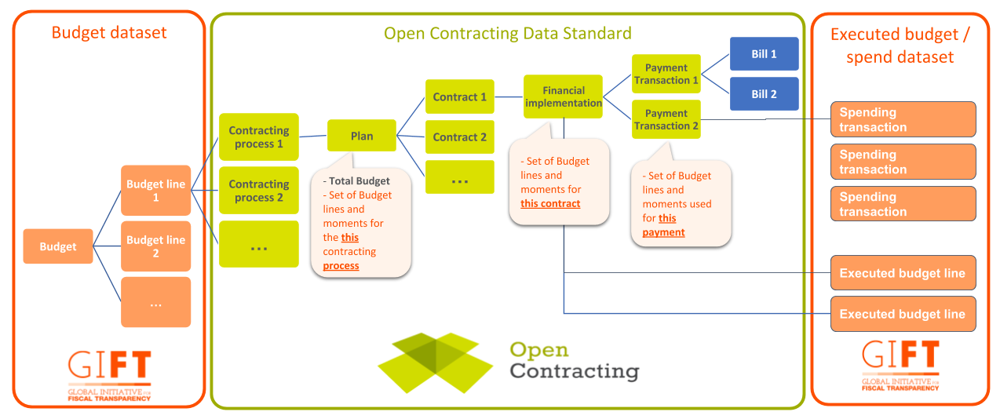

# Open Contracting Budgets and Spend Extension

The Budgets and Spend extension extends [budget breakdown](https://github.com/open-contracting/ocds_budget_breakdown_extension/blob/master/README.md) and the contract implementation section to allow the publication of detailed budget allocations and execution for a contracting process.

A [discussion paper providing background approach taken is available here](https://docs.google.com/document/d/1b43JeG5YQ62tGTTbP7jTE4XqUxYzG-r-emgRILZPRn4/edit). 

This repository is under active development, and currently contains a [worked example](examples/) of how this extension can be used to record yearly financial commitments to a contracting process and individual contracts.

## In summary

This extension introduces three new features that build on the [budget breakdown](https://github.com/open-contracting/ocds_budget_breakdown_extension/blob/master/README.md) extension:

* `classifications` - allowing functional, economic and administrative classifications to be provided for each budget breakdown item;
* `measures` - allowing different budget measures (planned, committed, executed etc.) to be expressed at the contracting process level for each set of budget classifications;
* `fiscalBreakdownFieldMapping` - providing an approach to link to a Fiscal Data Package datapackage.json file that defines the meaning of each classification and measure, and that provides access to related budget-level data. 

In addition, it introduces the `financialProgress` object into `contracts/implementation`, allowing a detailed breakdown of the financial execution of each contract to be expressed, using the same `classifications`, `measures` and `fiscalBreakdownFieldMapping` features as for `budgetBreakdown`.

## Getting started

The best way to understand this extension is by looking at worked examples.

* The **[coordination example](examples/coordination.md)** illustrates how to express data on budget allocation and execution that may be drawn from different data systems (e.g. finance systems and procurement systems).

* The **[integration example](examples/integration.md)** illustrates how references to a Fiscal Data Package can support display of data to users, and comparison between contracting process level and budget level data. 

* The **[flat data example](examples/flat.md)** illustrates how the structured data published using this extension can be analysed using spreadsheet tools.

## Key concepts

This extension provides the tools to create data that links **budgets**, **contracting processes** and **spending**

Drawing on definitions from the [Global Initiative for Fiscal Transparency (GIFT)](http://www.fiscaltransparency.net/):

**A budget** is a forward-looking statements of how an organisation proposes to raise revenues, spend resources, and finance its operations. The National Government budget should cover all the activities of a state. Detailed budgets may also exist at the level of agencies and projects. In public contracting, the funding for a contracting process may come from a particular section of the National budget, or from an organisational budget. It may also come wholly or partially from an external funders budget (e.g. an International Development Bank), either directly, or passing through government systems. 

Budget lines are constructed from a set of **classifications** (often described in terms of Functional, Administrative and Economic classifications), and **measures** (such as the original amount committed to a particular set of classifications, or the modified, or executed, amounts).

**Fiscal reports** are records of [an organisations] actual (historical) revenues, **spending** and financing. They may report the fiscal activities of the central government, state governments, or local governments, or of all levels of government in a country (referred to as the general government). Reports may cover a whole government in aggregate as an entity, and/or individual government entities e.g. ministries, departments or agencies. They may be on a cash or accruals basis (full or partial). As payments are made during the execution of a contract, these may be allocated against one or more sections of the budget. In some cases, this may allow the creation of fiscal reporting at the level of individual contracts. 

The Open Contracting Data Standard is used to share information about **contracting processes**. A contracting process may go through a number of stages over time, including planning, tender, award, contract signature and implementation. 

## Relating budget, contracting and spend

The image above presents a schematic representation of how budget, contracting and spend datasets may interact. 

Note that:

* This does not represent a linear sequence of events. Data may become available at different points in time, such as when budgeting takes place on an annual cycle, but contracts are signed to cover multiple years. In such cases, the budget information in the `planning` section of an OCDS contracting process may be updated after contracts are awarded and being implemented.

* Budget and spend data may be provided at varying levels of granularity, from a single budget line that funds multiple contracting processes, to the fiscal classification of individual items of spend against a particular contract. Data publishers will vary as to the level of detail that can be extracted reliably from their systems.

* Budget execution data may exist at the transactional level, or may exist at a more aggregated level. This extension currently covers budget execution, but does not cover detailed classification of transactions.

## Joined up data standards: connections with the fiscal data package

The [Fiscal Data Package](https://frictionlessdata.io/specs/fiscal-data-package/), developed by Open Knowledge with the support of [GIFT](http://www.fiscaltransparency.net/), provides *"a lightweight and user-oriented format for publishing and consuming fiscal data"*. Unlike OCDS, which requires data to be converted to a set JSON structure before publication, a Fiscal Data Package consists of:

* A data package definition (datapackage.json) which describes the 'logical model' to apply to existing data files. This defines columns, their relationship to fiscal concepts, and how they should be transformed by consuming applications in order to create normalised data.
* Data files, which provide the 'physical model' for budget or spending dataset, and may be the direct exports from existing systems. 

Considerable research and user-testing has taken place to develop the Fiscal Data Package, establishing that, instead of seeking agreement on some global set of fiscal concepts, it is important, given the diversity of budget and spending systems around the world, to allow publishers to provide data using their existing fiscal concepts, and to then annotate these with additional data that can progressively support comparison and analysis across datasets. 

To avoid duplication of effort by data publishers and consumers, this extension defers to the Fiscal Data Package model with respect to the definition of fiscal concepts, and follows FDP's approach of allowing use of existing data column names. Whilst FDP makes no direct distinction between 'classifications' and 'measures', considering both to be instances of 'fiscal concepts', in this extension we do draw a distinction to allow measures to be validated as numerical, whilst classifications can take string or number values. 

## Background 

A full exploration of the approach taken in this extension can be found in the [background discussion paper](https://docs.google.com/document/d/1b43JeG5YQ62tGTTbP7jTE4XqUxYzG-r-emgRILZPRn4/edit).  

### User stories & requirements

The budget and spend extension was designed around a set of user stories. 

* U1: As a journalist I want to see the budget source of a particular contracting process in order to understand whether funding has come from domestic resources, loans or other international revenue

* U2: As a journalist I want to find all the contracts funded through a particular budget source in order to analyse the extent to which the budget is spent via contracting or other means

* U3: As a civil society organisation focussed on infrastructure I want to find all the contracting processes related to a given infrastructure programme or project so that I can carry out a review of compliance with infrastructure project transparency requirements. 

* U4: As a journalist I want to track (suspicious) contracts in order to identify potential connections between the recipients and the officials and politicians in control of the budgeting and award processes.
Identifying and confirming budget allocations

* U5: As a potential supplier I want to see when budget availability is confirmed for a given contracting process so that I can plan a pipeline of potential bidding opportunities.

* U6: As a civil society monitoring organisation I want to identify projects without confirmed budget so that I can analyse the funding gap for planned procurement

* U7: As a treasury official I want to share information on the status of budget allocations and spending for any given contract so that I can demonstrate to the public that the budget is being spent in accordance with approved plans

* U8: As a procurement monitor I want to see how much of the spend on an infrastructure project has come from the capital budget vs the revenue budget so that I can monitor over or underspend

* U9: As a civil society organisation I want to identify how far particular budget lines have spend allocated against them, and the status of that spend over time so that I can report on areas of over or under spending.
Tracking the payment process

* U10: As an academic I want to identify the gap between invoice date and payment date so that I can analyse how prices are affected by payment timelines

* U11: As an auditor I want to see full details of the billing and payment process so that I can identify potential red flags and investigate particular processes 

These user stories were used to identify a set of requirements that the extension should meet. The table below outlines the extent to which the current extension meets the requirements that were identified. 

| ID | Requirement | Requirement met? | How does the extension meet this requirement? | 
|----|-------------|------------------|-----------------------------------------------| 
| R1 | Uniquely identify each relevant budget line | Yes | BudgetBreakdown is extended with a flexible `classifications` object that can include any number of classification properties, mirroring the terms and column names used within budget datasets. | 
| R2 | Uniquely identify the projects providing funding to a contracting process | Partially | No changes are currently introduced to meet this use case. The core budget object already includes a `projectID` field. |
| R3 | Provide amounts for different budget phases including confirmed budget allocations | Yes | BudgetBreakdown is extended with a flexible `measures` object that can include any number of measure properties, mirroring the terms and column names used within existing budget and spending datasets. | 
| R4 | Classify transactions against budget lines | No | Disaggregated financial progress information can be classified against budget lines in the contract implementation `financialProgress/breakdown` section, but the extension does not currently modify the `transactions` block to allow classification at the individual transaction level. |
| R5 | Provide information on the transaction process, from invoice to payment | Partial | The `measures` in `financialProgress/breakdown` for each contract can be used to describe different moments of payment processing. However, this only provides a full history of the timing of payment processes when used with a detailed version history of releases. An alternative approach of adding details of `transactions` to represent different moments such as requests for payment and payment approvals has not been included in this extension, but may be developed separately in future. |
| R6 | Allow individual amount allocations of budget to contract within OCDS to be checked against overall budget line allocations in a budget dataset | Yes | Through use of a link to the Fiscal Data Package it is possible to compare the contract-level financial information in OCDS with similarly classified information in an FDP. | 
| R7 | Provide front end interfaces with the information needed to display budget information to users | Yes | When used in conjunction with a Fiscal Data Package, applications can lookup labels and meta-data for each `classification` and `measure` in order to display information clearly to users. |
