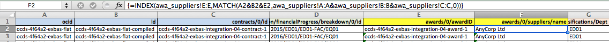

# Structured -> Tabular Data

The Open Contracting Data Standard, and the budgets and spend extension, have been structured to support round-tripping data between 'flat' (tabular) and tree structured (JSON) data representation.

The python package [flatten-tool](https://flatten-tool.readthedocs.io/en/latest/) is used in the OCDS Validator to allow creation of spreadsheet or multiple CSV file representations of an OCDS JSON file. The resulting tables should be ready to:

* Join together to have a full picture of each contracting process and contract;
* Join against fiscal data from a Fiscal Data Package;
* Perform aggregation operations on.

## Worked example

### Getting started

We can use the [OCDS Data Review Tool](http://standard.open-contracting.org/validator/) to convert our example data into a spreadsheet. It is possible to carry out the same task at the command line using flatten-tool, and to get a collection of CSV files as the output, instead of/in addition to an Excel file.

```
flatten-tool flatten --root-list-path=releases -m releases -r ocid FILE.json
```

The resulting data is split across multiple tables, one for each of the possible one-to-many relationship in the extended OCDS. We are primarily interested in:

* releases (which contains top-level planning and tender details)
* awards
* awa_suppliers (award > suppliers - as supplier information is provided at award level)
* contracts
* con_imp_fin_breakdown (contracts > implementation > financialProgress > breakdown)

Each table will contains:

* A set of identifiers that pick out the related data in other tables; 
* An additional identifier that can be used in picking out this row (usually the last of the initial set of /id columns);
* A set of columns providing data;


The combination of all the initial `id` columns in a sheet should always be unique, and can be used as a composite 'foreign key' to join tables together. In a spreadsheet it is possible to use 'Index Match' formulas to fetch data across tables. 

> Tip: As column headings us the long OCDS field paths (e.g. contracts/0/implementation/financialProgress/breakdown/0/classifications/Dept) it may help to change the alignment of the header row to 'right aligned' so that you see the last, rather than the first, part of each heading. 

### Bringing data together

#### Index(Match) basics

You might be familiar with the 'VLookup' formula in Excel. Index(Match) is a more sophisticated version of this. It allows you to carry out a lookup on multiple columns at once, and fetch any columns in response. 

We use the **Match** formula to return the number of the (first or last) row on which a combination of values is found. 

> For example, {=MATCH(A2&B2&C2,contracts!A:A&contracts!B:B&contracts!C:C,0)} looks for the first time where the values from A2, B2 and C2 in the current sheet are found in columns A, B and C respectively in the 'Contracts' sheet. 

We use the **Index** formula to then retrieve the value of a particular column at that row.

> For example {=INDEX(contracts!D:D,MATCH(A3&B3&C3,contracts!A:A&contracts!B:B&contracts!C:C,0))} will fetch the value of 'Contracts' sheet, column D. 

Note: Index(Match) is an *array formula**. To tell Excel this, you may need to press `Cntrl-Enter` (or `Cmd-Enter` on mac), rather than just `Enter` when entering the formula. Excel shows it has interpreted the array formula by containing it within { } brackets. 

#### Implementation -> Contracts -> Awards -> Suppliers

We want to be able to see who the supplier is for each financialProgress breakdown entry. To do this, we need to:

- Lookup the contract related to each breakdown, and find the relevant awardID
- Find the supplier for that awardID

The image below shows the two columns added to achieve this. 



Column E has the formula:

`=INDEX(contracts!D:D,MATCH(A2&B2&C2,contracts!A:A&contracts!B:B&contracts!C:C,0))` 

which is used to locate the awardID. Column F then has the formula:

`=INDEX(awa_suppliers!E:E,MATCH(A2&B2&E2,awa_suppliers!A:A&awa_suppliers!B:B&awa_suppliers!C:C,0))` 

which locates the supplier name from award > suppliers. 

With the resulting table, it is possible to filter financial progress information by supplier, or to create a pivot chart based on this. 

Note: n cases where there is more than one supplier for an award, this approach will only fetch the first supplier. It is important to be aware that it may not always be possible to 'flatten' all the data you need in all circumstances without repeated rows. 

#### Joining to Financial Data

We can use the same Index(Match) approach to merge the data in OCDS, with the data from a Fiscal Data Package file. Assuming:

* The budget/spending data file is published as a single table (or can be converted into one)
* The buddget/spending data file includes only a single row for each combination of classifications;
* The budget/spending data file is small enough to open in Excel

Then by paste it in as an additional table, you can fetch any measure it contains by using Index(Match) across all the classifications.